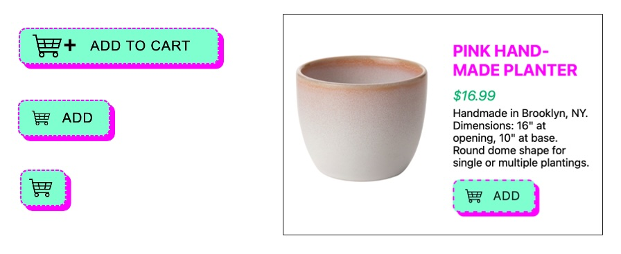

# Don't repeat yourself - Component Library

## The New Responsive

Waarin je leert over responsive design, container queries en user-preference queries

### Aanpak

Je hebt na de sprint planning variaties geschetst van je component en een hifi ontwerp uitgewerkt. Vandaag gaan we aan de hand van het artikel [The new responsive: Web design in a component-driven world](https://web.dev/articles/new-responsive) onderzoeken wat responsive design betekent voor jouw component en hoe je moderne ontwikkelingen van CSS hiervoor kan gebruiken.

<!-- Voor deze workshop 
Lees het artikel The New Responsive met je tafel.  Bespreek een strategie hoe je de drie onderdelen (responsive to the user, responsive to the container, responsive to the form factor ) kan toepassen op jullie Component Library. 
Schets voor je eigen component een breakdown voor het toepassen van User preference media features en Container queries. Onderzoek hoe het werkt en ….  -->

Responsive web design anno 2025 is een website die zich aanpast aan de vorm van het apparaat, met componenten die zich aanpassen aan de ruimte die beschikbaar is, én waarbij je rekening houdt met gebruikersinstellingen,. 

## Responsive Web Design

Responsive web design is moeilijk. Er bestaan al veel apparaten met verschillende schermen en er komen steeds meer apparaten bij met afwijkende schermformaten. Kleine ronde schermen zoals smart watches, schermen die in- en uitklapbaar zijn (foldables) of die je om je arm kan dragen... wot?

Sinds Ethan Marcotte in 2010 de term Responsive Web Design bedacht, zijn er in CSS steeds meer technieken bij gekomen om rekening te houden met moderne ontwikkelingen. `flexbox`, `grid`, `container queries`, `minmax`, `clamp`, `viewport units` en meer.

Met CSS kan je ook steeds beter rekening houden met gebruikersinstellingen van het apparaat zoals light/dark modes, wel of geen animaties of high contrast. Je kan websites maken die zich aanpassen aan de gebruiker.

 
_Responsive design betekent dat je rekening houdt met de viewpoort, met afwijkende schermen, én met gebruikerinstellingen._

## Responsive to the Form Factor
_Responsive to the Form Factor_ betekent dat een website zich ook aanpast aan de vorm van een apparaat. Door de uitvinding van flexibele schermen kunnen handhelds gevouwen worden. Bijvoorbeeld Samsung is hiermee bezig. Sommige studenten hebben een smarthphone met gevouwen scherm. (Stella?).

<!--
> Flexponsive Design
>
> Evolved responsive strategy that anticipates non-linear screen behaviours such as folding, spanning, stretching beyond 4K, or rotating to portrait mode on oversized touch displays.
>
> [Mastering Responsive Layouts for Foldables and 4K Screens](https://www.zignuts.com/blog/flexponsive-design-for-foldables-and-4k-screens)
-->

 
_Design prototype voor de Samsug S Fold_

Om hier layouts voor te maken zijn _Viewport Segments API_ bedacht. Dit is nog in de experimenteel fase, nog niet alle moderne brwosers ondersteunen dit. Maar dit komt eraan! https://developer.mozilla.org/en-US/docs/Web/API/Viewport_segments_API

### 👉 Opdracht Foldable screens

Bekijk jullie website in de devtools van Chrome op de _Galaxy Z Fold_ en _Asus Zenbook Fold_. Klopt de layout nog? Wat zou je nog meer kunnen bedenken en maken voor _foldables_?

Bekijk met je team de voorbeeld video voor _foldable screens_ op https://web.dev/articles/new-responsive#responsive_to_the_form_factor

Zoek design inspiratie voor foldable schermen en bewaar voorbeelden in je Figma document. Bijvoorbeeld op Dribbble of Pinterest. 

Maak in jullie Figma een template voor verschillende _fold_ schermen en werk een paar ideeen lowfi uit. 

Lees met je team de bron [Screen configurations](https://web.dev/learn/design/screen-configurations/) op Web.dev en doe de quiz aan het eind van het artikel.

#### Could Have
Maak een issue aan met jullie design ideeen, voeg inspiratie toe en bronnen hoe je dit zou kunnen maken. Voeg het label 'could have' toe ...

### Bronnen 
- [Building Web Layouts For Dual-Screen And Foldable Devices](https://www.smashingmagazine.com/2022/03/)
- [Responsive Design / Screen configurations](https://web.dev/learn/design/screen-configurations/)
- [Viewport Segments API](https://developer.mozilla.org/en-US/docs/Web/API/Viewport_segments_API)

## Responsive to the User
Een Media query ‘luistert’ naar de instellingen van de gebruiker zoals light/dark mode en toegankelijkheid settings.

### User preference media features (Level 5)

In de level 5 _User preference media features_ kan je in CSS rekening houden met verschillende gebruikers instellingen, zoals:  

- prefers-reduced-motion
- prefers-reduced-transparency
- prefers-contrast
- forced-colors
- prefers-color-scheme
- prefers-reduced-data
- inverted-colors (color media features)

https://developer.mozilla.org/en-US/docs/Web/CSS/Guides/Media_queries/Using

<!--
### 👉 Opdracht Mediaqueries level 3,4 en 5
Onderzoek met je tafel welke Media Features van mediaqueries er zijn in Level 3, 4 en 5 van de W3C specs.
-->

### 👉 Opdracht User preference media features
Ontwerp je component voor verschillende _User preference media features_.

Lees eerst met je team het onderdeel 'Responsive to the user' op https://web.dev/articles/new-responsive#responsive_to_the_user

Dupliceer het ontwerp van je component in Figma en maak variaties op je design voor 
prefers-reduced-motion, prefers-contrast, prefers-color-scheme en inverted-colors. Zorg dat je ontwerp voldoet aan de instellingen van de gebruiker ... Maak een annotatie in je Figma waarin je de media-feature en het ontwerp uitlegt.

Maak per variatie een breakdown, onderzoek hoe je de media feature in CSS goed kan gebruiken. 

Maak een issue aan zodat je hier later mee verder kan. Documenteer je onderzoek in het issue. 

## Responsive to the Container

Behalve media queries bestaan er tegenwoordig Container queries in CSS. 

> Container queries are like media queries but different. With media queries, you can adjust CSS based on the viewport width (or height etc.). But with container queries, you can adjust the CSS based on the width of a given container.
https://dev.to/jannikwempe/container-queries-in-svelte-using-svelte-actions-33ga

Als je voor een component container queries gebruikt kan je de layout laten aanpassen aan de beschikbare ruimte. Als je het component op verschillende plekken in een website gebruikt, past het zich vanzelf aan aan de beschikbare ruimte. Vet ... 

> [...] many designs have common components that change layout depending on the available width of their container. This may not always relate to the size of the viewport, but instead, relate to where in the layout the component is placed.
— MDN - CSS Container Queries https://developer.mozilla.org/en-US/docs/Web/CSS/CSS_Container_Queries

 
_Een button component 'add to cart' wordt op verschillen plekken gebruikt in een website. Het label past zich aan aan de hoeveelheid ruimte - [Responsive Icon Demo Mariam Suzanne](https://codepen.io/miriamsuzanne/pen/RwQmmrw)_

### Opdracht 👉 Component in detail ontwerpen en bouwen met container queries

Bekijk met je team de voorbeeld video met de planten in het onderdeel 'Responsive to the container' op https://web.dev/articles/new-responsive#responsive_to_the_container

Werk je eigen component in detail uit in Figma. Hou er rekening mee dat het component op verschillende plekken in de website gebruikt kan worden. Neem als voorbeeld de button uitwerking van de [Responsive Icon Demo](https://codepen.io/miriamsuzanne/pen/RwQmmrw)_

Maak een breakdown met breakpoints, onderzoekn en noteer hoe je het component met container queries kan bouwen. 

Maak een bijpassend issue, verzamel je schetsen en onderzoek. 

<!--
- Component responsive uitwerken op basis van het artikel (voorbeeld Ina menu dinges) 
  - color scheme dark mode/light mode/high contrast, nog een?
  - states, focus, hover, active
  - 

- Breakpoints bepalen (button voorbeeld)

- Breakdown: Lagen toevoegen voor the new responsive/user prefs, ...???
  - code voorbeelden onderzoeken, uitproberen en opnemen in de breakdown, onderzoek opnemen in issues? 
  - 
-->

## 💪 Extra uitdagingen

Onderzoek de _Viewport Segments CSS media features_ en bouw een demo. Hou je werk bij in het issue met foldable design ideeen.

## ✒️ Leervragen

Noteer per onderdeel van het artikel [The new responsive: Web design in a component-driven world](https://web.dev/articles/new-responsive) minimaal 1 ding dat je nog niet kent, zoek een bron en maak aantekeningen in je learning journal zodat je het (later) kan onderzoeken.

